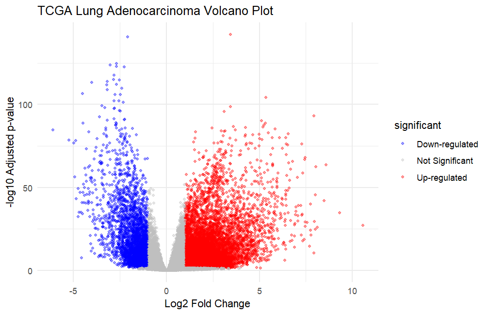
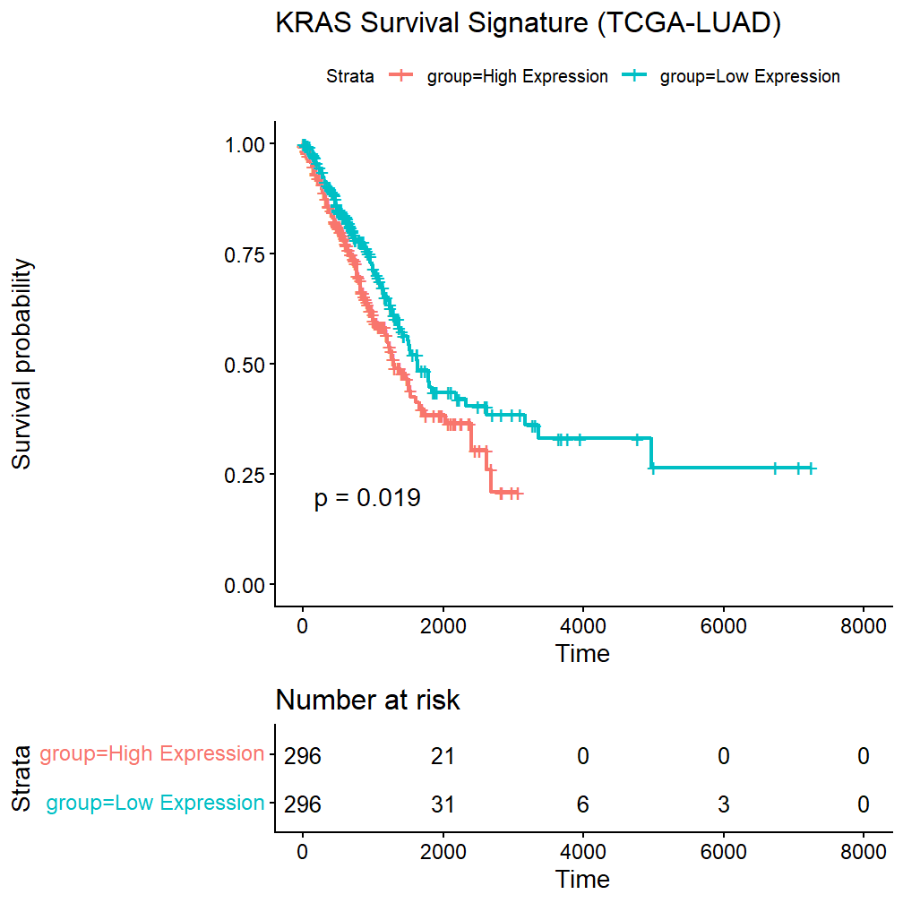
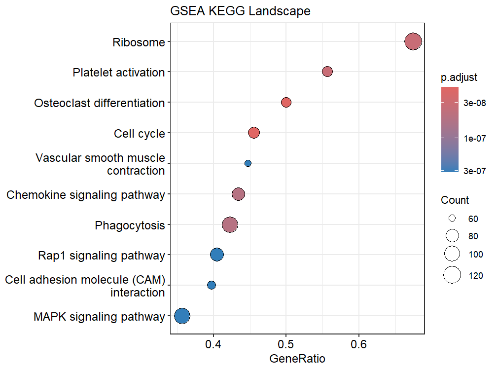

# Integrated Computational Transcriptomics & GSEA Pipeline (TCGA-LUAD)

## 🧬 Project Overview
This production-grade bioinformatics repository contains a complete, automated pipeline engineered to process and evaluate high-throughput RNA-Seq data from the Lung Adenocarcinoma (`TCGA-LUAD`) patient cohort. 

The workflow seamlessly transitions from raw counts normalization to exploratory target identification. It implements threshold-free Gene Set Enrichment Analysis (GSEA) to map oncogenic pathway perturbations and evaluates specific oncogene transcripts (e.g., `KRAS`) against longitudinal clinical survival matrices.

## 🚀 Key Engineering & Computational Highlights
* **Automated Data Persistence Caching:** Features a robust local evaluation wrapper that checks for the existence of `tcga_luad.rds` before calling the GDC server API, saving critical bandwidth and runtime overhead.
* **Continuous Rank-Metric Scoring:** Re-engineered traditional over-representation analysis by converting raw statistical variances into a continuous sorted vector based on Wald test configurations, enabling non-biased threshold-free GSEA.
* **Robust Graphic Automation:** Employs explicit device output pipelines (`png` writing wrappers) with fail-safe conditional handling blocks (`if(nrow...)`) to ensure error-free automated plotting execution.

## 📂 Repository Architecture
```text
├── r_scripts/
│   └── luad_gsea_pipeline.R     # Complete processing, GSEA, & analysis script
├── images/
│   ├── volcano_plot.png         # Transcriptional distribution landscape
│   ├── kras_survival_curve.png  # KM-curve tracking normalized KRAS values
│   ├── gsea_go_dotplot.png      # GSEA GO Term Category Distribution
│   ├── gsea_go_ridgeplot.png    # Activation/Suppression frequency densities
│   ├── gsea_kegg_dotplot.png    # KEGG Pathway distribution landscape
│   └── gsea_kegg_ridgeplot.png # Activation/Suppression frequency densities
└── README.md                    # Core deployment & functional architecture documentation
```

## 📊 Core Analytical Outputs

### 1. Differential Expression Profile
Using empirical Bayes shrinkage models, samples were stratified into tumor vs normal states to map broad genetic deregulation across the LUAD cohort.



### 2. Clinical Biomarker Case Study (KRAS Prognostics)
Instead of arbitrary raw counts, the pipeline extracts exact size-factor normalized expressions of `KRAS` to split the patient population across the historical clinical median, calculating robust log-rank p-values and generation matrices.



### 3. Pathway Level GSEA Activations
By ranking all detectable transcripts across their diagnostic Wald statistic values, the pipeline reveals whole-system shifts in metabolic profiles and structural cell cycle behaviors without human threshold bias.

| GSEA KEGG Pathways Distribution |
|---|---|
|  |

## 🏁 Execution Architecture
1. Clone this workspace:
   ```bash
   git clone https://github.com
   cd tcga-luad-gsea-pipeline
   ```
2. Open your R Environment and source the automation script:
   ```r
   source("r_scripts/luad_gsea_pipeline.R")
   ```
